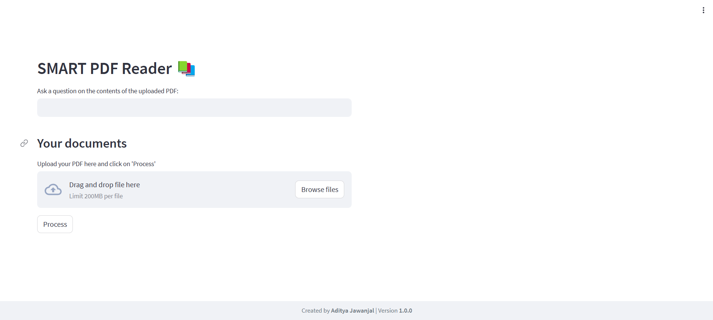

# Interactive PDF Reader using LangChain and Streamlit

In this project, We’ll create an interactive PDF reader using **LangChain** and **Streamlit**.

## How It Works

1. **Upload PDF**  
   When a user uploads a PDF file, the application:
   - Extracts text in chunks from the PDF
   - Generates **embeddings** for each chunk
   - Creates a **searchable database** of these embeddings

2. **Chatbot Interaction**  
   Users can ask questions using a chatbot interface. Here's what happens:
   - An embedding is generated for the user's question
   - The system searches the database for the most relevant text chunks
   - The most relevant chunk, along with the chat history, is used as context
   - A **Large Language Model (LLM)** generates a natural language answer
   - The response is displayed to the user and added to the chat history

This makes it easy to understand and explore any PDF with simple questions and answers.

### Thank You for Your Time!
